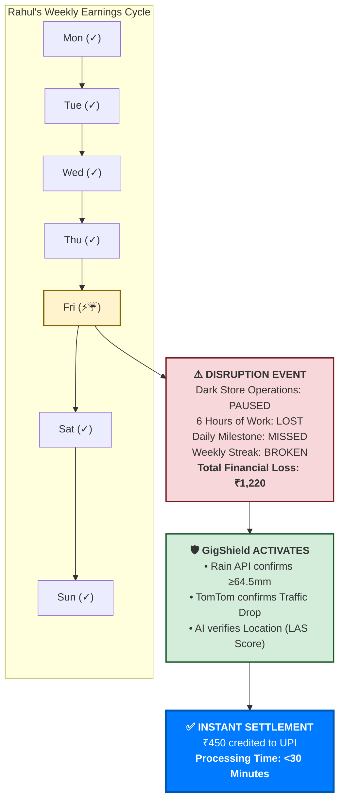
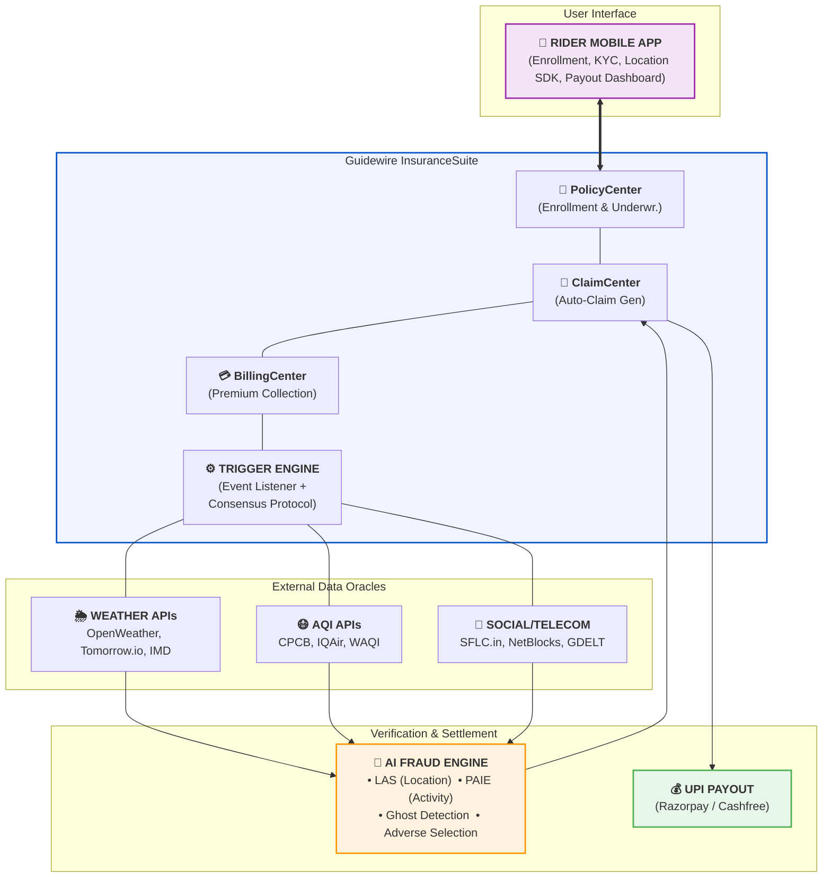
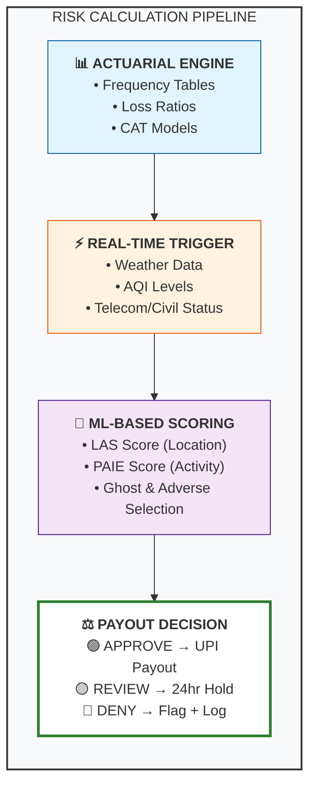
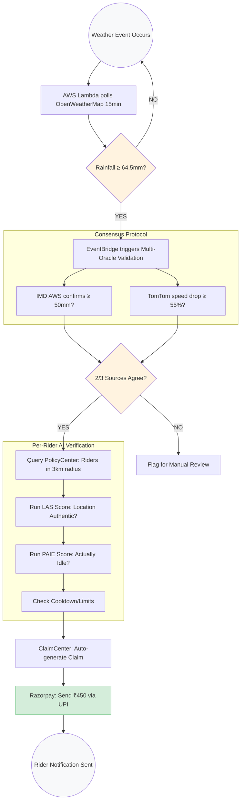

<!-- ======================================================================= -->
<!--  README.md — GigShield: Parametric Income Insurance for India's Gig Workers -->
<!--  Guidewire DEVTrails Hackathon — Phase 1 Submission                        -->
<!-- ======================================================================= -->

<div align="center">

# 🛡️ GigShield

### Parametric Income Insurance for India's Gig Economy Workers

**Guidewire DEVTrails Hackathon — Phase 1**

[](https://www.guidewire.com/)
[](https://reactnative.dev/)
[](https://nodejs.org/)
[](https://aws.amazon.com/)
[](https://opensource.org/licenses/MIT)

*API-native, event-driven microinsurance where the claim is generated by a machine, verified by AI, and settled by code — without the rider filing a single form.*

---

[Executive Summary](#1-executive-summary) · [Persona](#2-detailed-persona) · [The Solution](#3-the-solution) · [AI/ML Integration](#4-aiml-integration) · [Tech Stack](#5-tech-stack--architecture) · [Roadmap](#6-six-week-development-roadmap)

</div>

---

## 1. Executive Summary

### The Problem

India's gig economy employs over **7.7 million workers** in quick-commerce alone (Zepto, Blinkit, Swiggy Instamart). These delivery partners — the backbone of urban logistics — have **zero income protection** against disruptions they cannot control:

| Disruption | Frequency (Delhi-NCR) | Income Lost per Event |
|---|---|---|
| Severe Rainfall / Urban Flooding | 15–25 days/year | ₹1,220 (22% of weekly pay) |
| Extreme Heatwave (>45°C) | 30–45 days/year | ₹350–₹525/day |
| Hazardous AQI (>400 Severe) | 20–40 days/year (Oct–Jan) | ₹300–₹450/day |
| Internet Shutdowns | 3–8 events/year | ₹200–₹800/event |
| Section 144 / Curfew Orders | 2–6 events/year | ₹250–₹750/event |

**The cascading damage is worse than it appears.** Quick-commerce platforms gamify earnings through daily milestones and weekly streaks. A single 6-hour disruption on a Friday doesn't just cost the rider that day's wages — it **breaks their weekly streak**, causing a total loss of **₹1,220** (base pay + daily incentive + weekly streak bonus). That's **22% of their entire weekly income**, gone because of rain.

> **No traditional insurance product covers this.** Health insurance won't pay for a flood. Motor insurance won't cover lost wages. And no claim adjuster is going to process a ₹450 payout within 30 minutes.

### The "Why" — Social Impact

- **300 million** Indians work in the informal/gig economy with no safety net
- **0%** have parametric income protection of any kind
- Traditional insurance requires claim forms, adjusters, and weeks of processing — fundamentally incompatible with the gig economy's daily wage cycle
- Climate disruptions are increasing in frequency and severity across Indian metros

### Our Answer: GigShield

**GigShield** is an **API-native parametric microinsurance platform** built on **Guidewire InsuranceSuite** that provides instant, automated income protection to gig workers.

**Core Principle:**
> *"If X happens, pay Y. No claim form. No adjuster. No delay."*

The system monitors real-time data from weather APIs, air quality sensors, telecom networks, and government alerts. When a measurable event crosses a pre-defined threshold, the platform **automatically generates a claim, validates the rider's exposure, screens for fraud, and sends a UPI payout** — all within **30 minutes**.

**The rider pays ₹35/week and receives ₹450/disrupted day, automatically.**

---

## 2. Detailed Persona

### Meet Rahul — "The High-Frequency Hustler"

<div align="center">

| Attribute | Detail |
|---|---|
| **Name** | Rahul, 24 years old |
| **Origin** | Tier-2/3 town in UP/Bihar |
| **Current Location** | Shared room in Delhi-NCR |
| **Vehicle** | BS4-compliant Hero Splendor (petrol two-wheeler) |
| **Platform** | Primary: Blinkit/Zepto. Surge hours: Swiggy Instamart |
| **Work Style** | Gig-based. 10–12 hrs/day logged in. 25–30 deliveries/day |
| **Dark Store Radius** | Tethered to a specific store, 2–3 km delivery radius |

</div>

### Financial Profile


| Category | Details |
| :--- | :--- |
| **Gross Weekly Earnings** | ₹6,500 – ₹8,000 |
| **Base Pay** | ₹15–₹20 per order |
| **Distance Pay** | Minimal (<2.5 km) |
| **Incentives/Milestones** | 35–40% of total |
| **Weekly Expenses** | ₹1,800 – ₹2,200 (Fuel, Data, Food) |
| **NET WEEKLY TAKE-HOME** | **₹4,700 – ₹5,800** |
| **Payout Cycle** | Weekly (Tue/Wed) |


### 📉 The Cascading Loss Scenario
**Scenario:** Heavy rain on Friday afternoon (4 PM – 10 PM). Dark store pauses operations for 6 hours.


| Earning Component | Normal Friday | Disrupted Friday | Financial Impact |
| :--- | :--- | :--- | :--- |
| **Orders** | 28 Orders | 10 Orders | -18 Orders |
| **Base Pay** | ₹500 | ₹180 | -₹320 |
| **Daily Milestone** | ₹300 | ₹0 | -₹300 (Missed) |
| **Weekly Streak** | ₹600 | ₹0 | -₹600 (Broken) |
| **TOTAL EARNINGS** | **₹1,400** | **₹180** | **-₹1,220** |

> **⚠️ Analysis:** A single 6-hour disruption causes a **22% drop** in weekly net income (₹5,500 → ₹4,280) due to the "Domino Effect" of broken streaks and missed incentives.


> **💡 Key Insight:** The incentive structure means a single disruption causes **3x the direct loss** because of missed milestones and broken streaks. This is why parametric insurance — which pays immediately and could potentially trigger "streak forgiveness" — is uniquely valuable for this persona.

### 🔄 Rahul's Weekly Workflow & Disruption Touchpoints



---

## 3. The Solution

### 3.1 Parametric Triggers — The Five Shields

GigShield monitors five distinct disruption categories, each with a precise, measurable trigger threshold validated by multiple independent data sources.

#### Trigger T1: Severe Rainfall / Urban Waterlogging

| Parameter | Specification |
|---|---|
| **Threshold** | Rainfall ≥ 64.5mm/24hr (IMD "Heavy Rain") AND rate ≥ 10mm/hr for 3+ consecutive hours |
| **Geographic Resolution** | 3 km radius around rider's registered dark-store pin code |
| **Time Loss** | 6–8 hours |
| **Payout** | Tier 1: 64.5–115mm → ₹400. Tier 2: >115mm → ₹750 |
| **Cooldown** | Max 2 payouts/month |
| **Primary API** | OpenWeatherMap One Call API 3.0 |
| **Secondary API** | IMD Open Data (data.gov.in) |
| **Corroboration** | TomTom Traffic Flow API (speed drop >55% vs. 30-day baseline) |

#### Trigger T2: Severe Heatwave

| Parameter | Specification |
|---|---|
| **Threshold** | Ambient Temp ≥ 45°C OR Heat Index ≥ 50°C, sustained ≥ 3 consecutive hours (11 AM – 5 PM IST) |
| **Geographic Resolution** | City-district level |
| **Time Loss** | 4–5 hours |
| **Payout** | Flat ₹350/triggered day |
| **Cooldown** | Max 8 payouts/month (May–July) |
| **Primary API** | Tomorrow.io (Climacell) |
| **Secondary API** | OpenWeatherMap |
| **Corroboration** | IMD Orange/Red Heatwave Alert (mandatory co-trigger) |

#### Trigger T3: Hazardous Air Quality (AQI)

| Parameter | Specification |
|---|---|
| **Threshold** | AQI ≥ 400 ("Severe") for ≥ 8 consecutive hours, OR AQI ≥ 450 for ≥ 4 hours |
| **Geographic Resolution** | CPCB monitoring station level |
| **Time Loss** | 4–6 hours |
| **Payout** | ₹300/triggered day |
| **Cooldown** | Max 10 payouts/season (Oct 15 – Jan 31) |
| **Primary API** | CPCB Real-Time AQI API |
| **Secondary API** | IQAir / AirVisual API |
| **Tertiary / Tie-breaker** | WAQI (World Air Quality Index) API |

#### Trigger T4: Telecom / Internet Shutdown

| Parameter | Specification |
|---|---|
| **Threshold** | Confirmed mobile internet shutdown ≥ 4 hours in rider's registered zone |
| **Geographic Resolution** | District / Pin-code cluster level |
| **Time Loss** | 12–48 hours |
| **Payout** | ₹200 per 8-hour block, capped at ₹800/event |
| **Cooldown** | Max 3 events/month |
| **Primary API** | SFLC.in Internet Shutdowns Tracker |
| **Secondary API** | NetBlocks / OONI |
| **Corroboration** | Downdetector ISP scraping (>80% "no data" reports) |

#### Trigger T5: Civil Unrest / Section 144 / Curfew

| Parameter | Specification |
|---|---|
| **Threshold** | Official govt gazette notification of Section 144 or curfew, effective ≥ 4 hours |
| **Geographic Resolution** | Police station jurisdiction / Ward level |
| **Time Loss** | 6–24 hours |
| **Payout** | ₹250 per 8-hour block, capped at ₹750/event |
| **Cooldown** | Max 2 events/month |
| **Primary API** | GDELT Project API (NLP event classification) |
| **Secondary API** | District Admin e-Gazette scraper |
| **Corroboration** | Google Maps Traffic API (speed drop >70%) |

### Consolidated Trigger Matrix

| # | Trigger | Threshold | Primary API | Secondary | Corroboration | Max Payout | Cooldown |
|---|---|---|---|---|---|---|---|
| T1 | Heavy Rain | ≥64.5mm/24hr + ≥10mm/hr 3hr | OpenWeatherMap 3.0 | IMD AWS | TomTom Traffic | ₹750 | 2/month |
| T2 | Heatwave | Temp≥45°C OR HI≥50°C 3hr | Tomorrow.io | OpenWeather | IMD Alert | ₹350 | 8/month |
| T3 | AQI Severe | AQI≥400 8hr OR ≥450 4hr | CPCB API | IQAir | WAQI | ₹300 | 10/season |
| T4 | Internet Off | Confirmed ≥4hr shutdown | SFLC.in | NetBlocks/OONI | Downdetector | ₹800 | 3/month |
| T5 | Section 144 | Official order ≥4hr | GDELT | Govt e-Gazette | Google Traffic | ₹750 | 2/month |

### Multi-Oracle Consensus Protocol

No payout is ever triggered by a single data source. Every trigger requires:

To ensure 100% data integrity, GigShield employs a **majority-vote consensus** before triggering a payout:

> [!IMPORTANT]
> **Primary API** confirms threshold breach  
> **AND** at least **ONE SECONDARY** source confirms (within 15% tolerance)


| Scenario | Resolution Logic |
| :--- | :--- |
| **Primary & Secondary Disagree** | Query **TERTIARY** source → Majority vote (2 of 3) wins |
| **All Three Disagree** | **NO** auto-payout → Route to human underwriter |
| **Data Integrity** | All API responses logged with **cryptographic timestamps** |


---
### 🧮 Actuarial Calculation: The Base Premium

To ensure the product is sustainable, we calculate the **Pure Premium** using the following variables:

$$
\text{Daily Payout} = \text{Avg. Daily Earnings (₹750)} \times \text{Replacement Rate (70\%)} = \mathbf{₹450}
$$


| Variable | Value | Description |
| :--- | :--- | :--- |
| **Annual Disruption Days** | 2.25 Days | Expected paid events per year across all triggers |
| **Weekly Probability ($P$)** | 4.33% | $2.25 \text{ days} / 52 \text{ weeks}$ |
| **Pure Premium** | **₹19.50** | $0.0433 \times ₹450$ (Expected claims cost only) |

> **Note:** This "Pure Premium" represents the raw cost of claims before operational loading, reserves, and profit margins are added.


#### Loading Structure

| Component | % of Pure Premium | Amount (₹) |
|---|---:|---:|
| Pure Claims Cost | — | 19.5 |
| Operations / Admin | 20% | 3.9 |
| Fraud & Data/API Cost | 10% | 2.0 |
| Catastrophe / Reserve Margin | 25% | 4.9 |
| Profit / Sustainability Margin | 10% | 2.0 |
| **Total Weekly Premium** | | **₹32.3 → Rounded: ₹35** |

#### Final Pricing

> **Recommended Weekly Premium: ₹35/week**
> - Only **0.78%** of weekly earnings
> - Well below the **₹50/week** affordability ceiling
> - Target loss ratio: **~55.6%** (healthy microinsurance range)

#### Premium vs. Coverage Table (Product Menu)

| Plan | Weekly Premium | Daily Payout | Max Paid Days/Month | Max Monthly Benefit | Best For |
|---|---:|---:|---:|---:|---|
| **Basic** | ₹25 | ₹300 | 2 | ₹600 | Ultra price-sensitive riders |
| **Standard** ⭐ | ₹35 | ₹450 | 3 | ₹1,350 | Balanced protection (recommended) |
| **Plus** | ₹45 | ₹600 | 3 | ₹1,800 | Higher earners / high-risk zones |

#### Annual Unit Economics (per rider)

```text
Annual Premium Collected    = 52 × ₹35    = ₹1,820
Annual Expected Claims      = 2.25 × ₹450 = ₹1,012.50
Gross Margin                = ₹807.50/year
Loss Ratio                  = 55.6%
```

#### Risk Pooling — Surviving a City-Wide Flood

The platform uses a **three-layer solvency architecture**:
### 🛡️ Three-Layer Solvency Architecture

To ensure **Team DeployX** remains solvent during city-wide disasters, we implement a multi-tiered risk management strategy:

> [!TIP]
> **LAYER 1: GEOGRAPHIC DIVERSIFICATION**  
> * **Mechanism:** Pool riders across multiple metros (Delhi, Mumbai, Bengaluru, Hyderabad, Pune).  
> * **Logic:** A flood in one city does not hit all cities simultaneously. Different trigger types have different seasonality patterns (e.g., Delhi Heatwaves vs. Mumbai Monsoons).

> [!IMPORTANT]
> **LAYER 2: CATASTROPHE RESERVE FUND**  
> * **Allocation:** ₹4.9/week per rider allocated directly to a reserve.  
> * **Scale:** For 100k riders, this generates **₹4.9 lakh/week** in continuous accumulation.  
> * **Target:** Maintain 8–12 weeks of expected claims in reserve at all times.

> [!CAUTION]
> **LAYER 3: REINSURANCE / STOP-LOSS**  
> * **Retention:** Platform retains the first ₹50 lakh of weekly catastrophe loss.  
> * **Coverage:** Reinsurer covers losses above ₹50 lakh up to the contract limit.  
> * **Edge:** Parametric products are easier to reinsure due to transparent triggers and objective data.


**Catastrophe Scenario Math:**

### ⛈️ Stress Test: The "City-Wide Flood" Scenario
*Example: 50,000 insured riders in a single metro area (e.g., Delhi-NCR).*

> [!CAUTION]
> **Weekly Revenue:** 50,000 riders × ₹35 = **₹17.5 Lakh**  
> **Major Event:** 20% riders claim: 10,000 × ₹450 = **₹45.0 Lakh**  
> **The Gap:** This specific week is "underwater" by **₹27.5 Lakh** in isolation.

**How Team DeployX ensures Solvency:**
* [x] **Accumulated Reserves:** Using the 49 "low-claim" weeks to offset the 3 "high-claim" weeks.
* [x] **Cross-City Diversification:** Mumbai/Bengaluru premiums supporting the Delhi flood loss.
* [x] **Stop-Loss Reinsurance:** External capital absorbing losses exceeding the ₹50 Lakh threshold.
* [x] **Exposure Caps:** Hard-coded limits on payouts per rider per month to prevent a total pool drain.


---

## 4. AI/ML Integration

### 4.1 Architecture Overview



### 4.2 Fraud Detection — Five AI/ML Modules

Every parametric insurance system is vulnerable to fraud because payouts are automatic. GigShield deploys five adversarial countermeasure algorithms:

#### Module 1: Location Authenticity Score (LAS)

**Threat:** GPS Spoofing — rider fakes location to a flood-prone zone while actually being in an unaffected area.

```python
# ALGORITHM: Location Authenticity Score (LAS)
# Prevents GPS spoofing fraud

def calculate_LAS(rider_id, claimed_zone, event_timestamp):
    
    # STEP 1: Historical Mobility Fingerprint
    # - 30 days of GPS pings from background location SDK
    # - DBSCAN clustering on nighttime (11PM-6AM) pings → "Home Zone" polygon
    # - Calculate: median_lat, median_lon, movement_radius_p90
    
    # STEP 2: Event-Day Behavior Check
    # a) GPS within 3km of dark-store for ≥2 hours in 6 hours BEFORE event?
    # b) Cell-tower triangulation matches GPS? (spoofed GPS ≠ cell tower)
    # c) Wi-Fi BSSID scan consistent with registered zone?
    
    # STEP 3: Velocity Anomaly
    # Previous ping 40km away + current at dark-store = IMPOSSIBLE TRAVEL
    # (>150 km/h in city = spoofing indicator)
    
    # STEP 4: Weighted Scoring
    LAS = weighted_sum(
        historical_zone_match      = 0.30,
        cell_tower_gps_concordance = 0.30,
        wifi_bssid_familiarity     = 0.15,
        velocity_plausibility      = 0.15,
        device_sensor_consistency  = 0.10   # accelerometer/gyroscope
    )
    
    if LAS >= 0.75: return "AUTO_APPROVE"
    if LAS >= 0.50: return "MANUAL_REVIEW_24HR"
    return "AUTO_DENY_FLAG_INVESTIGATION"
```

#### Module 2: Platform Activity Inference Engine (PAIE)

**Threat:** Double-Dipping — rider claims insurance payout for rain but was earning on a competing platform (Swiggy Food, Dunzo) during the same window.

```python
# ALGORITHM: Platform Activity Inference Engine (PAIE)
# Detects multi-platform earning during claimed disruption

def calculate_activity_score(rider_id, event_window):
    
    # DIRECT: Query gig platform APIs (if data partnership exists)
    # - If rider completed >3 orders on ANY platform → DENY
    
    # INDIRECT: Phone behavior inference (consented)
    # a) Screen-time on competing gig apps (Android UsageStats API)
    # b) Battery drain pattern: active delivery = 8-12%/hr GPS+screen drain
    # c) Step count: active delivery = 200-400 steps/hr (walking to doors)
    #    Zero movement = genuinely idle
    
    # POST-HOC: Weekly earnings reconciliation via Account Aggregator
    # - If total weekly earnings ≥ normal baseline DESPITE trigger → flag
    
    # Score: 0.0 = idle (genuine) → FULL PAYOUT
    #        0.5 = partial activity → 50% PAYOUT
    #        1.0 = full activity elsewhere → DENY
```

#### Module 3: Anti-Adverse-Selection Engine

**Threat:** Storm Chasing — rider buys insurance only when forecasts predict heavy rain, cancels on clear days.

```text
RULE 1: Minimum 30-day continuous enrollment. 7-day waiting period.
RULE 2: Forecast-aware enrollment block — if 72-hour forecast shows >70%
        probability of trigger event → BLOCK or apply 2x surge premium.
RULE 3: Loyalty multiplier — 90+ day continuous enrollment = 10% discount.
        Buy-cancel-buy patterns = 1.5x premium tier.
RULE 4: Per-rider loss ratio monitoring — if payouts/premiums > 3.0 over
        90 days → auto-trigger underwriting review.
```

#### Module 4: Ghost Rider Detection

**Threat:** Identity farming — one person creates multiple accounts using different Aadhaar numbers, collects multiple payouts for the same event.

```text
STEP 1: Device fingerprinting (IMEI hash, Android ID, SIM serial,
        screen resolution, installed app hash, battery signature)
        → 2+ accounts sharing fingerprint = FLAG

STEP 2: Behavioral biometrics (typing patterns, swipe pressure,
        app interaction cadence) → similarity > 0.90 = LINK + FLAG

STEP 3: Network graph analysis (shared phone, device, UPI, IP,
        Wi-Fi, address) → cluster of ≥3 accounts sharing ≥2 edges = FLAG

STEP 4: Payout destination analysis
        → Multiple accounts routing to same UPI/bank = AUTO-BLOCK
```

#### Module 5: Multi-Oracle Consensus Protocol

**Threat:** Data source manipulation — submitting false AQI readings or DDoS-attacking weather APIs.

```text
RULE: No payout from a SINGLE data source.
      PRIMARY + SECONDARY must agree (15% tolerance).
      Disagreement → TERTIARY tie-breaker → majority vote.
      All disagree → NO auto-payout → human underwriter.
      All responses: cryptographic timestamps + blockchain-anchored hash.
```

### 4.3 Risk Calculation Architecture



**Premium Formula (implemented in Guidewire PolicyCenter):**

```text
Weekly_Premium = (Expected_Disruption_Days_Per_Year × Payout_Per_Day / 52)
                × (1 + Expense_Load + Risk_Margin)

Example:   = (2.25 × 450 / 52) × 1.65
           = ₹19.5 × 1.65
           ≈ ₹32.2 → Rounded: ₹35/week
```

## 5. Tech Stack & Architecture

### 5.1 Stack Overview


| Layer | Technology | Rationale |
| :--- | :--- | :--- |
| **Mobile App** | React Native (Expo) | Single codebase for Android + iOS. Critical for rider adoption on low-end Android devices. |
| **Backend API** | Node.js + Express.js | Event-driven, non-blocking I/O ideal for real-time trigger processing. |
| **Insurance Core** | Guidewire InsuranceSuite (Cloud) | PolicyCenter (enrollment), ClaimCenter (auto-claim gen), BillingCenter (premium collection). |
| **Trigger Engine** | AWS Lambda + EventBridge | Serverless functions polling APIs every 15 min. EventBridge orchestrates consensus. |
| **Database** | PostgreSQL + DynamoDB | PostgreSQL for ACID compliance; DynamoDB for high-throughput GPS ping storage. |
| **AI/ML Engine** | Python (SageMaker) | LAS scoring, PAIE inference, ghost detection, and anomaly detection. |
| **Payments** | Razorpay / Cashfree | Instant UPI payouts (<30s) and UPI Autopay for weekly premiums. |
| **Location SDK** | Google Play Services | Background location pings for LAS fraud detection. |
| **Monitoring** | CloudWatch + Grafana | Real-time dashboards for triggers, payout volumes, and fraud flags. |
| **CI/CD** | GitHub Actions | Automated testing, staging, and production deployment. |
| **Auth** | Firebase + Aadhaar eKYC | OTP-based login and Aadhaar verification via DigiLocker API. |

### 5.2 Data Flow — From Event to Payout


## 6. Six-Week Development Roadmap

### Phase 1 MVP — Hackathon Deliverable


| Week | Sprint Focus | Key Deliverables |
| :--- | :--- | :--- |
| **Week 1** | Foundation & Guidewire Setup | Guidewire Cloud sandbox provisioned. PolicyCenter product model created (Basic/Standard/Plus plans). React Native project scaffolded with Expo. Firebase Auth + Aadhaar eKYC stub integrated. PostgreSQL schema designed. |
| **Week 2** | Trigger Engine — Weather | AWS Lambda functions for OpenWeatherMap polling (15-min). IMD data integration. TomTom Traffic API integration. EventBridge multi-oracle consensus workflow. Rainfall trigger T1 functional end-to-end. |
| **Week 3** | Trigger Engine — AQI & Heatwave | Tomorrow.io integration for T2. CPCB + IQAir integration for T3. Trigger evaluation engine generalized. Cooldown/cap logic implemented per rider per trigger. |
| **Week 4** | AI Fraud Engine (Phase 1) | Location SDK integrated in mobile app. LAS algorithm v1 (historical zone match + velocity anomaly). Device fingerprinting at enrollment. Basic ghost rider detection. |
| **Week 5** | Payments & ClaimCenter Integration | Razorpay UPI Payout API integration. UPI Autopay for weekly premium collection. Guidewire ClaimCenter auto-claim generation workflow. End-to-end flow: trigger → validation → fraud check → claim → payout. |
| **Week 6** | Polish, Testing & Demo | Integration testing across all 5 trigger types. Load testing (simulate 10,000 riders). Demo scenario preparation. Documentation finalized. Hackathon pitch deck and live demo ready. |

### Post-Hackathon Roadmap (Phase 2+)


| Quarter | Milestone |
| :--- | :--- |
| **Q1** | Internet Shutdown (T4) and Section 144 (T5) triggers live. PAIE fraud module v1. Pilot with 500 riders in Delhi-NCR. |
| **Q2** | Mumbai + Bengaluru expansion. SFLC.in and GDELT API partnerships. Reinsurance arrangement with a parametric-friendly reinsurer. |
| **Q3** | Account Aggregator integration for earnings reconciliation. Dynamic premium engine (per-rider risk scoring). 10,000 riders enrolled. |
| **Q4** | Multi-language app (Hindi, Kannada, Marathi, Tamil). Platform partnerships (Blinkit, Zepto API for streak forgiveness). IRDAI sandbox application. |


### 7. Repository Structure

```mermaid
graph TD
    %% Root Directory
    Root[<b>gigshield/</b>]

    %% Main Subdirectories
    Root --- Docs[<b>docs/</b>]
    Root --- Mobile[<b>mobile/</b>]
    Root --- Backend[<b>backend/</b>]
    Root --- Infra[<b>infrastructure/</b>]
    Root --- GW[<b>guidewire/</b>]
    Root --- Tests[<b>tests/</b>]

    %% Docs Details
    Docs --- D1[persona-research.pdf]
    Docs --- D2[trigger-design.pdf]
    Docs --- D3[actuarial-model.pdf]

    %% Mobile Details
    Mobile --- M1[src/screens]
    Mobile --- M2[src/services]
    Mobile --- M3[app.json]

    %% Backend Details
    Backend --- B1[src/routes]
    Backend --- B2[src/triggers]
    Backend --- B3[src/fraud]
    Backend --- B4[package.json]

    %% Infrastructure Details
    Infra --- I1[lambda/]
    Infra --- I2[eventbridge/]
    Infra --- I3[sagemaker/]

    %% Guidewire Details
    GW --- G1[policy-center/]
    GW --- G2[claim-center/]
    GW --- G3[billing-center/]

    %% Styling
    style Root fill:#f8f9fa,stroke:#333,stroke-width:2px
    style Mobile fill:#e1f5fe,stroke:#01579b
    style Backend fill:#fff3e0,stroke:#e65100
    style GW fill:#f3e5f5,stroke:#4a148c
```


## 8. Quick Start

```bash
# Clone the repository
git clone https://github.com/your-team/gigshield.git
cd gigshield

# Backend setup
cd backend
npm install
cp .env.example .env    # Add API keys (OpenWeather, Tomorrow.io, Razorpay, etc.)
npm run dev

# Mobile app setup (in a new terminal)
cd ../mobile
npm install
npx expo start

# Run trigger simulation (demo mode)
cd ../backend
npm run simulate:rainfall -- --zone="Mundka,Delhi" --intensity=75mm
```
## Environment variables Required

# Weather APIs
OPENWEATHER_API_KEY=your_key_here
TOMORROW_IO_API_KEY=your_key_here

# AQI APIs
IQAIR_API_KEY=your_key_here
WAQI_API_TOKEN=your_key_here

# Traffic
TOMTOM_API_KEY=your_key_here

# Payments
RAZORPAY_KEY_ID=your_key_here
RAZORPAY_KEY_SECRET=your_secret_here

# Guidewire
GUIDEWIRE_CLOUD_URL=your_sandbox_url
GUIDEWIRE_API_KEY=your_key_here

# Firebase
FIREBASE_PROJECT_ID=your_project_id

# AWS
AWS_REGION=ap-south-1
AWS_ACCESS_KEY_ID=your_key_here
AWS_SECRET_ACCESS_KEY=your_secret_here


## 9. Key Metrics for Hackathon Judges


| Metric | Value |
| :--- | :--- |
| **Weekly Premium** | ₹35 (0.78% of weekly earnings) |
| **Payout per Disrupted Day** | ₹450 (70% income replacement) |
| **Payout Speed** | < 30 minutes from trigger confirmation |
| **Target Loss Ratio** | ~55.6% |
| **Trigger Types** | 5 (Weather, Heat, AQI, Telecom, Civil) |
| **Data Sources** | 12+ independent APIs |
| **Fraud Detection Modules** | 5 AI-driven algorithms |
| **Target Year 1 Enrollment** | 25,000 riders (Delhi-NCR) |
| **Annual Premium Pool** | ₹5.97 Cr |
| **Social Impact** | First parametric income product for India's gig workers |


---

## 10. Team: DeployX 🚀


| Role | Responsibility |
| :--- | :--- |
| **Product Lead** | Persona research, actuarial model, hackathon narrative |
| **Full-Stack Engineer** | React Native app, Node.js backend, AWS infrastructure |
| **Insurance Architect** | Guidewire PolicyCenter/ClaimCenter configuration |
| **ML Engineer** | Fraud detection algorithms, trigger consensus protocol |

---
## 11. License

This project is licensed under the MIT License — see the [LICENSE](LICENSE) file for details.

---

<div align="center">

### Built with ❤️ for India's 7.7 million gig workers who deserve a safety net.

*GigShield: When the city fails them, we don't.*

**Guidewire DEVTrails Hackathon 2026 — Team DeployX**

</div>
---
